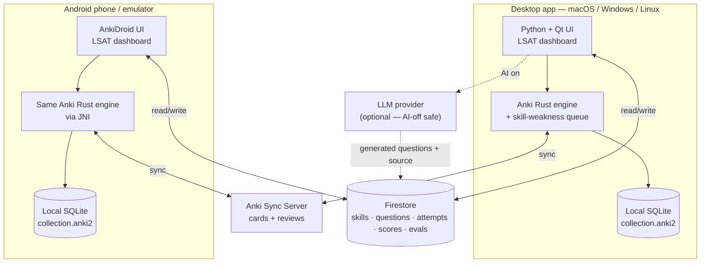
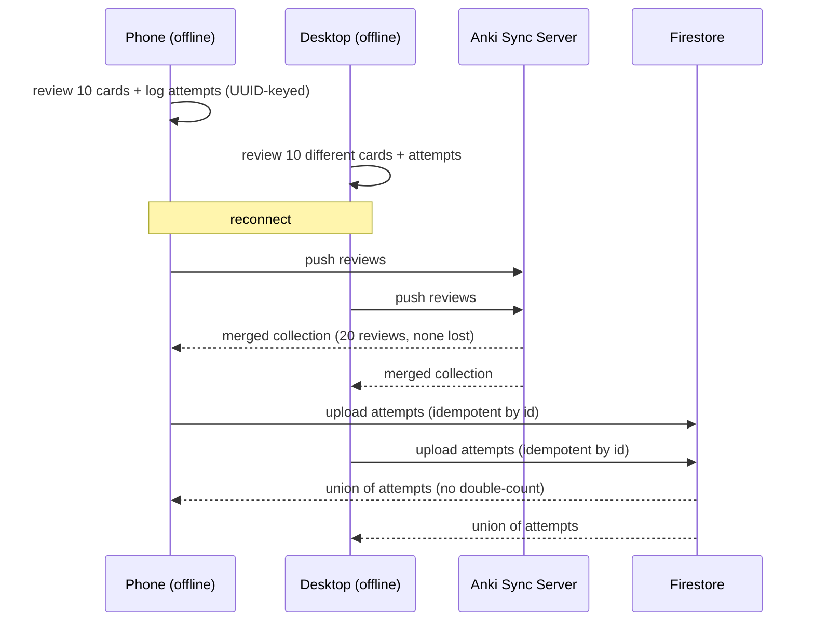
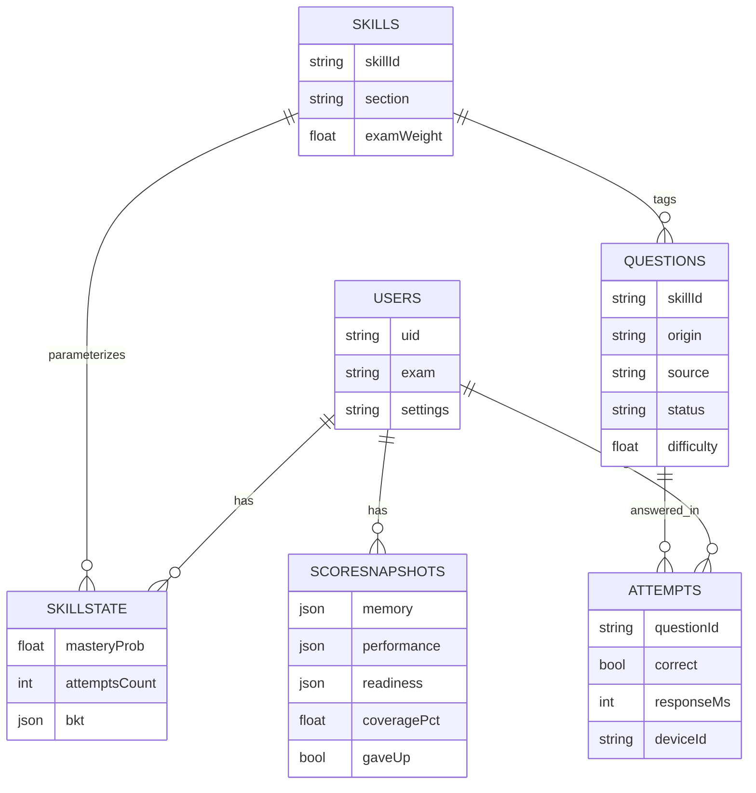

# Speedrun LSAT — PRD, Data Schema & Architecture

**Product:** An Anki fork (desktop) + Android companion that share one Rust engine and turn LSAT study into three honest, separately-reported scores.
**Exam:** LSAT (scored 120–180; 2 Logical Reasoning + 1 Reading Comprehension scored sections; writing + experimental unscored).
**Thesis (from brainlift):**
- **SPOV 1 — Spaced repetition solves the wrong problem.** FSRS measures memory well; the LSAT tests *applied reasoning*. We measure the memory→performance→readiness gap and never hide it.
- **SPOV 2 — The LSAT is an elimination game, not a recall game.** You win by killing trap answers, so we train and score *trap elimination* (name why each wrong answer is wrong) and *argument diagnosis* (name the flaw) — not answer recall.
- **SPOV 3 — Confidence is a trainable, measurable skill, and the honest readiness score falls out of it.** Students *stake conviction* on answers via a proper scoring rule; their stake-vs-outcome record *is* the calibration the honesty rule demands. Themed as a **conviction market** (Kalshi / poker feel) for a 20-something audience.
- **AI is build-time only:** it may pre-generate novel, source-cited problems to grow the bank *before* deploy; the app the student uses runs **AI-free** (no live/adaptive model).

---

## 1. Decisions (defaults — tell me to flip any)

| Decision | Default | Why this default |
|---|---|---|
| Exam | **LSAT** | Locked (your brainlift) |
| Mobile target | **AnkiDroid (Android emulator)** | Open-source AGPL, already wraps the shared Rust backend → easiest "one engine + sync." (iOS-via-FFI is valid but more signing friction.) |
| Rust engine change | **Concept scheduler** | Ranks due cards by `weakness × exam weight`, **retires solved problems** (fresh instances), and **discounts speed-guesses**; new protobuf RPCs called from Python. Implements SPOV 1–2. |
| Theme | **Conviction market** (Kalshi / poker feel) | Confidence-staking *is* the calibration mechanic, and the aesthetic fits a 20-something audience without being childish. |
| Study feature to ablate | **Interleaving** (mix LR skill types in a session) | Cited in your brainlift (Bjork, desirable difficulties). Hypothesis: raises accuracy on new mixed-skill questions at equal study time. |
| Sync / storage | **Anki sync (cards+reviews)** + **Firestore (LSAT score layer)** | Anki's sync already handles no-loss / no-double-count for reviews; Firestore holds skills, questions, attempts, scores, evals. |

---

## 2. Scope (MVP)

**In scope**
- LSAT on its real 120–180 scale.
- Desktop Anki fork + Android companion sharing the **same Rust engine**, two-way sync, offline-then-reconcile.
- LSAT **skill taxonomy** + **coverage map** (% of official outline the deck covers).
- **Rust change:** skill-weakness priority queue (3 Rust tests + 1 Python-callable test, undo-safe).
- **Reasoning engine (the not-flashcard core):** a **conviction-market** interaction — diagnose the argument, stake conviction across choices, name each wrong answer's trap; scored by a proper scoring rule; **fresh questions only** (retired once solved).
- **Three scores**, each with point estimate + range + coverage % + confidence + "last updated" + reasons + give-up rule:
  - Memory (FSRS, calibrated), Performance (staking + per-trap elimination on unseen items), Readiness (mapped to 120–180, calibrated from conviction stakes).
- **AI:** generate LR-style questions from a real source; every output traces to a named source; checked against a 50-item gold set; beats a keyword/vector baseline; **app still scores with AI off**.
- **Evals (re-runnable, held-out):** memory calibration (Brier/log-loss), performance accuracy, paraphrase test, leakage check, AI card check, one-command benchmark.
- Interleaving feature + **3-build ablation** (full / feature-off / plain Anki).

**Out of scope (MVP)**
- LSAT **writing** section (your brainlift) and **logic games** (removed Aug 2024).
- **iOS** (if Android is chosen), real-student score validation (Step 4 bonus), accounts/social, monetization.
- AI generation of full **RC passages** — RC is in the taxonomy/coverage/performance items, but MVP AI-generation targets **LR**; RC questions are curated.

---

## 3. Personas

**Primary — "Maya," self-studying retaker.** 22, recent grad, aiming ~168, can't afford a $4k course. Studies at a desk at home and on her phone between things. Wants the honest truth: *am I actually ready, and what do I drill next?*

**Secondary — cold-start beginner.** Just started; deck covers little of the exam. Needs the app to **abstain** from a readiness score and show coverage gaps.

**Not focused on:** students in full instructor-led courses (Princeton Review), casual users who only want flashcards, anyone seeking logic-games practice, non-LSAT exams.

---

## 4. User stories (essentials)

1. As a student, I review LSAT cards on **desktop or phone** and my progress **syncs both ways** without losing or double-counting reviews.
2. As a student, I see **three separate scores** (memory, performance, readiness), each with a **range**, not one blended number.
3. As a student, when I lack data the app **refuses to show a readiness score** and tells me why (coverage / # attempts).
4. As a student, I see **which skills I'm weakest at** and the app surfaces those cards **first** (Rust queue).
5. As a student, I get **AI-generated novel LR questions** for a skill, and can see the **source** each came from.
6. As a student studying offline, my reviews **queue locally** and sync cleanly when I reconnect.
7. As a student, I see **% of the LSAT my deck covers**, so I know what's missing.
8. As the evaluator (me), I can **re-run all evals with one command** and get the same numbers on held-out data.
9. As a student, I **stake my conviction** on answers and get a **calibration report** showing where I'm overconfident — so I learn to trust my instincts and when to guess and move on.
10. As a student, for each wrong choice I **name the trap** (why it's wrong), and the app tracks which **trap types** fool me most.

---

## 5. Domain model (LSAT)

**Sections (scored):** Logical Reasoning (×2) and Reading Comprehension (×1) → LR ≈ ⅔ of scored items, RC ≈ ⅓. Weights are configurable and derived from released official tests.

**Skills (the unit BKT tracks, the queue weights, and coverage measures):**
- **LR:** Necessary Assumption, Sufficient Assumption, Strengthen, Weaken, Flaw, Inference / Must Be True, Main Conclusion, Method of Reasoning, Parallel Reasoning, Principle, Paradox/Resolve, Point at Issue, Role in Argument, Evaluate.
- **RC:** Main Idea, Primary Purpose, Detail/Lookup, Inference, Author's Attitude/Tone, Function of a detail, Passage Structure, Comparative passages.

Each skill has: `examWeight` (frequency on the real exam), and per-student `mastery` (BKT).

**Trap taxonomy (the elimination axis — *why* wrong answers are wrong):** out of scope · too strong/extreme · reversal/opposite · half-right · correlation≠causation · could-be-true ≠ must-be-true · restates a premise/circular · plausible but unsupported · shifted subject/wrong comparison. Every practice item tags each wrong choice with its trap, so the app measures **elimination accuracy per trap type** (e.g., *"you fall for too-strong traps 40% of the time"*) — a second skill axis orthogonal to question type.

**Give-up rule (stated):** *No readiness score until the student has ≥ 200 graded performance attempts AND ≥ 50% topic coverage AND a computed calibration (from the student's conviction stakes).* Below that, show coverage + "not enough data," never a number.

**Honesty fields (every score carries):** point estimate, likely range, coverage %, confidence indicator, last-updated time, top reasons, and the give-up rule.

---

## 6. The reasoning engine + the three scores

**The core interaction is not a flashcard — it is a "conviction market" on one fresh question** (Kalshi / poker feel). For a never-before-seen item the student:
1. **Diagnoses** the argument — names the conclusion and, for flaw items, the reasoning error.
2. **Stakes conviction** — distributes a fixed budget across the five choices by how likely each is the answer, and/or stakes *against* a choice by naming its trap.
3. **Reveals & is scored by a proper scoring rule** (Brier/log) so honest probabilities win over the long run and bluffing (always max-stake) loses; then names the trap on each wrong choice.
4. **Final two** — splitting a stake between two contenders triggers a targeted discrimination drill.

Because solved problems are **retired** (fresh instances) and speed-guesses are discounted, every stage emits a signal and the three scores become a *byproduct of studying*:

| Score | Question | How it's produced here | Output (carries the honesty fields) |
|---|---|---|---|
| **Memory** | Recall the fact now? | FSRS on concept/definition cards | recall prob + range; calibrated |
| **Performance** | Answer a *new* question for this skill? | staking accuracy on fresh items + elimination accuracy per trap + argument-diagnosis accuracy | P(correct) on unseen items + range, per skill & trap |
| **Readiness** | Score today, how sure? | performance × exam weights, with the **calibration curve built from the student's stakes** | 120–180 + range + **calibration** + give-up + single best next thing |

**Calibration = the conviction track record.** Bucketing stakes vs. outcomes yields the honesty rule's hardest requirement — *how accurate your past guesses turned out to be* — e.g., *"when you staked 80% on Strengthen, you were right 58%: overconfident."* The **best next thing to study** is the trap/skill where your stakes are worst; low-conviction items get flagged for pacing (commit vs. guess-and-move).

---

## 7. Data: what's stored, where, and how it flows

### Source of truth
| Data | Owner | Store | Synced by |
|---|---|---|---|
| Decks, notes, cards, review logs, FSRS memory state | **Anki Rust engine** | Local SQLite (`collection.anki2`) | **Anki sync server** |
| Skill taxonomy + exam weights | App | Firestore (global) | Firestore |
| Per-student skill mastery (BKT), performance attempts, score snapshots, generated/gold questions, eval results, coverage | App | **Firestore** (per user) | Firestore |
| Unsynced offline attempts | App | Local cache / Firestore offline persistence | Firestore on reconnect |

### Firestore collections (fields)
- `skills/{skillId}` — `name, section (LR|RC), examWeight, description` *(global taxonomy + coverage reference)*
- `users/{uid}` — `displayName, exam:"LSAT", settings, createdAt`
- `users/{uid}/skillState/{skillId}` — `bkt {pL0,pT,pS,pG}, masteryProb, attemptsCount, lastUpdated`
- `questions/{questionId}` — `skillId, stem, choices[], answerIndex, rationale, difficulty (IRT b), origin (gold|generated|official), source {name, locator}, status (approved|blocked), checks {factual, teaching, duplicate}, createdAt`
- `users/{uid}/attempts/{attemptId}` — `questionId, skillId, correct, chosenIndex, stakes[] (conviction per choice), confidence, trapsIdentified{choiceIndex: trap}, responseMs, ts, deviceId, sessionId` *(immutable, UUID-keyed)*
- `users/{uid}/scoreSnapshots/{ts}` — `memory{p,lo,hi}, performance{p,lo,hi}, readiness{point,lo,hi}, calibration{brier, buckets[]}, coveragePct, confidence, reasons[], gaveUp, giveUpReason, nextBest, updatedAt`
- `evals/{evalId}` — `type (memory_calibration|performance|ai_cardcheck|baseline), metrics{...}, datasetHash, gitCommit, createdAt` *(re-runnable proof)*

### Example documents
```json
// questions/lr_necassum_042
{
  "skillId": "lr_necessary_assumption",
  "stem": "The columnist concludes that ... Which one of the following is an assumption required by the argument?",
  "choices": ["...","...","...","...","..."],
  "answerIndex": 2,
  "rationale": "Negating (C) breaks the link between premise and conclusion.",
  "difficulty": 0.7,
  "origin": "generated",
  "source": { "name": "Bjork & Bjork 2011, p.58 (logic of necessity)", "locator": "para 3" },
  "status": "approved",
  "checks": { "factual": true, "teaching": true, "duplicate": false },
  "createdAt": 1751299200
}
```
```json
// users/maya/attempts/8f2c-...-a91   (UUID = deviceId + local sequence)
{ "questionId": "lr_necassum_0042", "skillId": "lr_necessary_assumption",
  "correct": false, "chosenIndex": 1, "responseMs": 41250,
  "ts": 1751299500, "deviceId": "pixel7-emu", "sessionId": "s_2026_06_30_a" }
```

### Sync & conflict rule (the part the rubric grades hard)
- **Reviews/cards:** Anki's own sync merges the collection. Rule we document: card scheduling state resolves by **latest modification time**, and **both review-log rows are preserved** (counts never lost).
- **Performance attempts:** each attempt is an **immutable document keyed by a client-generated UUID**, so two devices reviewing offline create **distinct docs → union on sync (no winner needed, no double-count)**. Re-uploading the same attempt is **idempotent** (same id overwrites itself). This is effectively conflict-free.

---

## 8. Architecture & diagrams

### 8.1 System / hardware architecture


### 8.2 Offline review → sync (the sync test, 7b)


### 8.3 Firestore data model


---

## 9. Open questions to resolve before build
- Confirm the 5 defaults in §1 (mobile target, Rust change, study feature, sync split).
- Confirm Firestore vs. all-Anki-sync for the score layer.
- Source of the **deck content** + the **gold set** (which released/official-style LSAT material).
